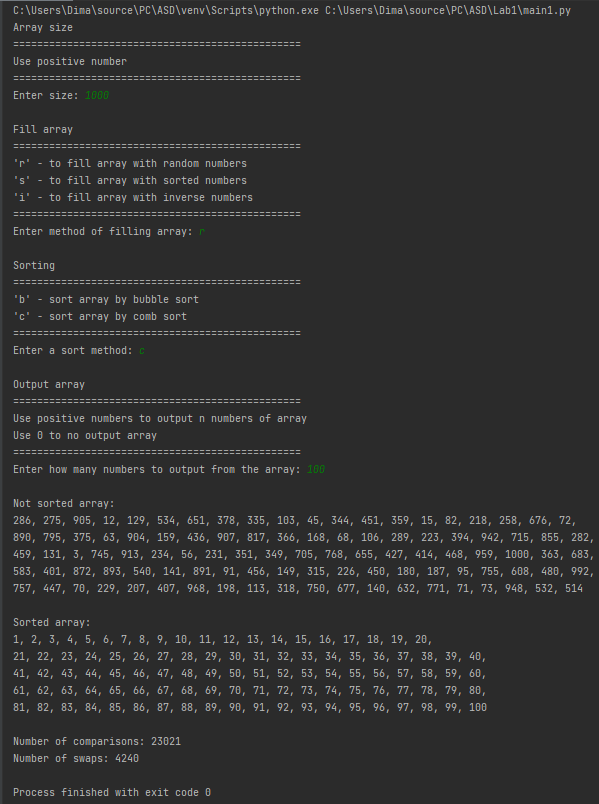

# Лабораторна 1

Мета роботи – вивчити основні методи аналізу обчислювальної складності алгоритмів внутрішнього сортування і оцінити поріг їх ефективності.

Аналіз алгоритму сортування бульбашкою на відповідність властивостям наведено в таблиці:

| Властивість  | Сортування бульбашкою |
| ----------- | ----------- |
| Стійкість|Так|
| «Природність» поведінки (Adaptability)|Ні|
| Базуються на порівняннях|Так|
| Необхідність в додатковій пам'яті (об'єм)|Ні|
| Необхідність в знаннях про структури даних|Так|

Аналіз алгоритму сортування гребінцем на відповідність властивостям наведено в таблиці:

| Властивість  | Сортування гребінцем |
| ----------- | ----------- |
| Стійкість|Так|
| «Природність» поведінки (Adaptability)|Ні|
| Базуються на порівняннях|Так|
| Необхідність в додатковій пам'яті (об'єм)|Ні|
| Необхідність в знаннях про структури даних|Так|

## Псевдокод алгоритму:
```
функція bubble_sort(arr)
	comp = 0
	swaps = 0
	повторити для i від 0 до (len(arr) - 1) з кроком 1
		повторити для j від 0 до (len(arr) - 1) з кроком 1
			comp += 1
			якщо arr[j] > arr[j + 1], то
				swaps += 1
				arr[j], arr[j + 1] = arr[j + 1], arr[j]
			все якщо
		все повторити
	все повторити
	повернути arr, comp, swaps
все функція

функція new_gap(gap, if_sorted)
	k = 1,247 
	gap = int(gap // k)
	якщо gap <= 1, то
		gap = 1
		if_sorted = True
	все якщо
	повернути gap, if_sorted
все функція

функція comb_sort(arr)
	comp = 0
	swaps = 0
	gap = len(arr)
	if_sorted = False
	повторити поки не if_sorted
		gap, if_sorted = new_gap(gap, if_sorted)
		повторити для i від 0 до (len(arr) - gap) з кроком 1
			comp += 1
			якщо arr[i] > arr[i + gap], то
				swaps += 1
				arr[i], arr[i + gap] = arr[i + gap], arr[i]
				if_sorted = False
			все якщо
		все повторити
	все повторити
	повернути arr, comp, swaps
все функція
```

## Аналіз часової складності

|| Сортування бульбашкою | Сортування гребінцем |
| ----------- | ----------- | ----------- |
| Найгірший випадок | O(n2) | O(n2) |
| Найкращий випадок | O(n2) | O(n2) |
| Середній випадок | Ω(n2) | Ω(n*log(n)) |

## Приклад роботи

Сортування бульбашкою масиву на 100 елементів:


Сортування гребінцем масиву на 100 елементів:


Сортування бульбашкою масиву на 1000 елементів:


Сортування гребінцем масиву на 1000 елементів:




## Тестування алгоритму

Характеристики оцінювання алгоритму сортування бульбашки для упорядкованої послідовності елементів у масиві: 
| Розмірність масиву | Число порівнянь | Число перестановок |
| ----------- | ----------- | ----------- |
| 10 | 81 | 0 |
| 100 | 9801 | 0 |
| 1000 | 99801 | 0 |
| 5000 | 24990001 | 0 |
| 10000 | 99980001 | 0 |
| 20000 | 399960001 | 0 |
| 50000 | 2499900001 | 0 |

Характеристики оцінювання алгоритму сортування гребінцем для упорядкованої послідовності елементів у масиві:
| Розмірність масиву | Число порівнянь | Число перестановок |
| ----------- | ----------- | ----------- |
| 10 | 36 | 0 |
| 100 | 1229 | 0 |
| 1000 | 22022 | 0 |
| 5000 | 144832 | 0 |
| 10000 | 329598 | 0 |
| 20000 | 719136 | 0 |
| 50000 | 1997680 | 0 |

Характеристики оцінювання алгоритму сортування бульбашкою для зворотно упорядкованої послідовності елементів у масиві:
| Розмірність масиву | Число порівнянь | Число перестановок |
| ----------- | ----------- | ----------- |
| 10 | 81 | 45 |
| 100 | 9801 | 4590 |
| 1000 | 99801 | 49950 |
| 5000 | 24990001 | 12497500 |
| 10000 | 99980001 | 49995000 |
| 20000 | 399960001 | 199990000 |
| 50000 | 2499900001 | 1249975000 |

Характеристики оцінювання алгоритму сортування гребінцем для зворотно упорядкованої послідовності елементів у масиві:
| Розмірність масиву | Число порівнянь | Число перестановок |
| ----------- | ----------- | ----------- |
| 10 | 45 | 9 |
| 100 | 1328 | 110 |
| 1000 | 23021 | 1512 |
| 5000 | 149831 | 9154 |
| 10000 | 339597 | 19018 |
| 20000 | 739135 | 40730 |
| 50000 | 2047679 | 110332 |

Характеристика оцінювання алгоритму сортування бульбашки для випадкової послідовності елементів у масиві:
| Розмірність масиву | Число порівнянь | Число перестановок |
| ----------- | ----------- | ----------- |
| 10 | 81 | 15 |
| 100 | 9801 | 2399 |
| 1000 | 99801 | 239258 |
| 5000 | 24990001 | 6293731 |
| 10000 | 99980001 | 24789932 |
| 20000 | 399960001 | 100281022 |
| 50000 | 2499900001 | 726493845 |

Характеристика оцінювання алгоритму сортування гребінцем для випадкової послідовності елементів у масиві:
| Розмірність масиву | Число порівнянь | Число перестановок |
| ----------- | ----------- | ----------- |
| 10 | 45 | 11 |
| 100 | 1328 | 260 |
| 1000 | 23021 | 4330 |
| 5000 | 149831 | 27354 |
| 10000 | 339597 | 60201 |
| 20000 | 739135 | 130823 |
| 50000 | 2047679 | 368327 |

### Графіки

Нижче показані графіки залежності часових характеристик оцінювання від розмірності масиву для випадків, коли масиви містять упорядковану послідовність елементів (зелений графік), коли масиви містять зворотно упорядковану послідовність елементів (червоний графік), коли масиви містять випадкову послідовність елементів (синій графік), також показані асимптотичні оцінки гіршого (фіолетовий графік) і кращого (жовтий графік) випадків для порівняння.

Сортування бульбашкою:


Сортування гребінцем:


## Висновок
При виконанні даної лабораторної роботи я дослідив алгоритм сортування бульбашкою та гребінцем (bubble sort та comb sort відповідно), провів аналіз алгоритмів на відповідність властивостям, та проаналізував часову складність алгоритмів та порівняв часові характеристики.
